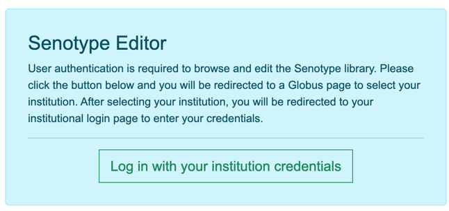
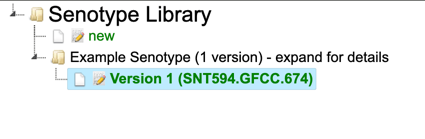
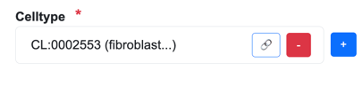
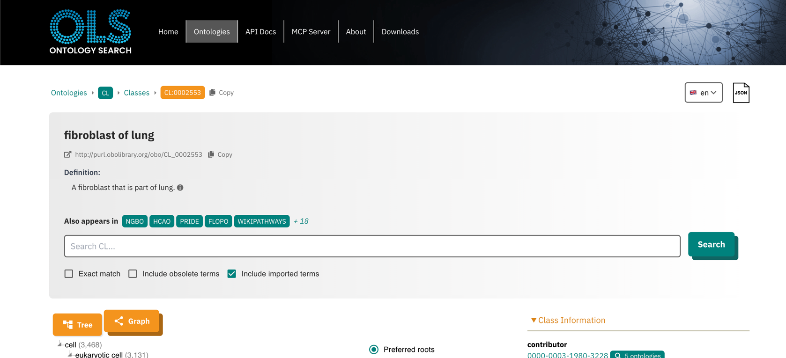
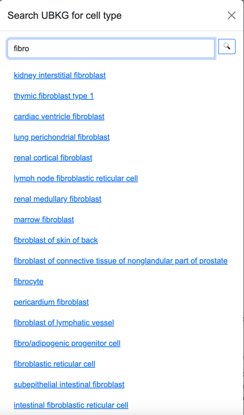
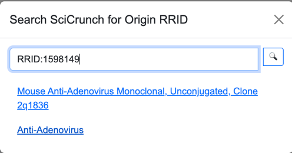

# Senotype Editor
## User Documentation

# Introduction

## Senotype
A *senotype*, or _senescence associated secretory phenotype_, is a cellular senescence functional definition and associated multidimensional description. 
A senotype associates a phenotype with other characteristics, including
- taxa
- locations in the body
- cell types
- microenvironments
- inducers
- hallmarks 
- assays
- citations
- origins (RRIDs)
- SenNet datasets
- a set of _markers_ (genes or proteins) 
- contextual data, such as age or BMI

A senotype can be represented as a knowledge graph of _assertions_--i.e., discrete relationships between the senotype and other entities. 
For example, a senotype can assert a _in_taxon_ relationship with an entity representing "human".


The entities and relationships of a 
senotype can be _encoded_--i.e., represented with codes from standard biomedical vocabularies. 

For example, the gene and protein markers associated with a senotype can be
identified with codes from HGNC and UniProt, with a relationship encoded by the 
Relations Ontology.


##  The Senlib Database
Senotype definitions are maintained in the *Senotype library* (**SenLib**). Senotype definitions are stored in Senlib in JSON format and conform
to the schema defined in the [senlib](https://github.com/sennetconsortium/senlib/blob/main/doc/Senotype_Submission_Schema.md) GitHub repository.

## The Senotype Editor
The **Senotype Editor** application allows users to manage senotype definitions in the Senlib database. 
Because the majority of the assertions in a senotype definition involve categorical data, most of the work of defining a senotype will
involve the selection of values from lists.


With the Senotype Editor, users can:
1. **review** a senotype definition
2. **create** a new senotype definition
2. **revise** a senotype definition

# User Authentication
Only users with Globus accounts with proper authentication will be able to use the Senotype Editor. 

Upon startup, the SenoType Editor will display a login page. 
The user will be authenticated in Globus. If the user's Globus account has the necessary privileges,
the user will be able to continue to the Edit page. 


# Components of the Senotype Editor
The Senotype Editor offers two types of tools:
1. the **Senotype Library Navigator** a tool to view the Senotype library of _senotype submissions_
2. tools to maintain senotype submissions


#### Senotype Library Navigator
The **Senotype Library Navigator** represents the Senotype library with an expandable tree view.
The Navigator organizes the different submissions of a senotype definition in version order.

#### Senotype Definition
The **Senotype Definition** composes the remainder of the Senotype Editor. The Senotype Definition section 
allows the user to build or revise a senotype definition. 
The components of the Definition section are linked to both the data of a particular senotype
submission and to possible values for data.

Because most of a senotype definition is encoded, another role of the Definition section is to 
translate the codes of a senotype definition into descriptive terms. 

# Business Rules of the Senotype Editor

**A user can only edit a senotype submission file for which they are authorized.** Authorization is controlled by means of the SenNet Consortium's Globus environment.

# Using the Senotype Library Navigator

A senotype definition is represented in the Navigator tree with a folder node (  ). Expanding the node for a senotype definition
displays the senotype submissions associated with the definition.

Senotype submission files are represented with a file node ( ). Submission nodes are organized hierarchically in terms of provenance
in the Senlib database. If a submission has a predecessor, the node for the submission can be expanded to view the 
predecessor.

When the user selects a submission file node in the Navigator, the Senotype Editor will load data 
for the submission into the Definition section.



## Edit state
The icon next to a submission node indicates whether the submission can be edited. 

A pencil icon () indicates that the submission can be edited.

## Authorization state
Only authorized users may edit a senotype.
If a senotype shows a "prohibited" icon ( ), the user is not authorized to edit the submission file. 
Although the data for the submission will still display in the Definition section, editing controls that can add, delete, or change data will be disabled.


## Creating a new senotype
The  node in the Navigator allows the user to define a new senotype. The Editor will load 
into the Definition section defaults for the new submission, including:
1. a new SenNet ID
2. the Globus name and email of the user, as submitter


# Using the Senotype Definition tools

## Required data

A senotype definition requires a minimal set of data. Data that are 
required for a senotype are indicated with a red asterisk.

## Submission information
The user can edit the **name** and **description** for the submission. 
The Navigator will use the name for the latest version of a senotype definition as 
the name of the definition node.

## Assertions
The Definition section allows the definition of assertions between a senotype and its characteristics.

Each input in the Definition section corresponds to an assertion in the senotype definition.
For example, the **Taxon** input corresponds to the senotype definition's  _in_taxon_ assertion.

There are four types of assertions. Each type has its own tool for selection.

## Valueset-based assertions
Most of a senotype definition's assertions will be categorical, in which the possible values for 
the object of the assertion will be in a _valueset_. For example, the categories for a 
senotype definition's **taxon** might be the valueset {_human_, _mouse_}.

The elements of valuesets are codes from biomedical vocabularies.

Valueset-based assertions include:

| type of assertion | source vocabulary |
|-------------------|-------------------|
| taxon             | NCBI              |
| hallmark          | SENOTYPE          |
| microenvironment  | SENOTYPE          |
| inducer           | SENOTYPE          |
| assay             | OBI               |
| sex               | SNOMED_CT         |

Because there can be multiple assertions of the same type, the inputs for valueset-based assertions are 
lists. For example, a senotype can assert relationships with multiple taxa:


### List buttons

#### Add
The  button opens a select window that displays a list with the members of the valueset 
associated with the assertion.
 Selecting an element in the list in the select window adds the selected value to
the list for the assertion. 

#### Remove
The  button removes an element from the assertion list.

## Context assertions

Context assertions are allow the user to define numerical ranges for an assertion.
 
For example, the **age** assertion can be bounded to apply only to the range of 18 to 89 years.

The current types of context assertions are
- age
- BMI

## External assertions

A number of the objects of assertions are encoded with codes from large vocabularies or ontologies, such as Cell Ontology. 
Instead of using internal valuesets for these inputs, the Senotype Editor obtains codes by searching external sources.

| assertion type   | source             | vocabulary              |
|------------------|:-------------------|-------------------------|
| location (organ) | UBKG               | Uberon                  |
| cell type        | UBKG               | Cell Ontology (CL)      |
| diagnosis        | UBKG               | Disease Ontology (DOID) |
| citation         | NCBI PubMed        | PMID                    |
| origin (RRID)    | SciCrunch          | RRID                    |
| dataset          | SenNet Data Portal | SenNet ID               |
| gene marker      | UBKG               | HGNC                    |
| protein marker   | UBKG               | UniProtKB               |

### Edit page

#### Translation of codes
Senotype definitions represent entities with codes. For example, 
if a senotype asserts a relationship with cell type "fibroblast of lung", 
its definition represents the cell type with the code **CL:0002553**.

When the Edit page loads information for an existing senotype, 
it translates codes into terms by searching external sources. The terms are 
only to provide human-readable descriptions: they are not stored in SenLib.



#### Add button
The  button in a list opens a select window that displays a list with the members of the valueset 
associated with the assertion.

#### Details button
The   button next to an assertion object links to a 
detail page in the source that corresponds to the object. 

For example, the details button next to a cell type opens the corresponding 
page for the cell type in EMBL-EBI's Ontology Lookup Service:  


| assertion object type | reference page                         |
|-----------------------|----------------------------------------|
| location              | SenNet Organs detail                   |
| cell type             | EMBL-EBI Ontology Lookup Service (OLS) |
| diagnosis             | Disease Ontology                       |
| citation              | PubMed                                 |
| origin                | RRID Portal (see below)                |
| dataset               | SenNet Data Portal                     |
| gene marker           | HGNC                                   |
| protein marker        | UniprotKB                              |

### Search window
#### Search box
In the Search window for an external assertion object, entering
input into the search box triggers a search against an external source. 
The results of a search appear below the search box as a list of links. 
Selecting a link from the result list will add the result to the corresponding
object list in the Edit page.



The forms of search terms depend on the external source. For example, to search for a cell type, a user
can enter either the Cell Ontology ID or a portion of the preferred term (e.g,. "fibroblast")

| input type | search source                         | forms of search term                                                          | example                                                      |
|------------|---------------------------------------|-------------------------------------------------------------------------------|:-------------------------------------------------------------|
| citation   | NCBI EUtils API                       | exact PMID; portion of publication title                                      | 41247924; predictors                                         |
| origin     | RRID Portal (SciCrunch)               | exact RRID                                                                    | 4850064                                                      |
| dataset    | SenNet entity-api; SenNet Data Portal | exact SenNet ID                                                               | SNT699.FVQD.882                                              |
| location   | hs-ontology API (UBKG API)            | portion of SenNet organ name                                                  | lung                                                         |
| diagnosis  | hs-ontology API (UBKG API)            | exact DOID; exact match for a preferred term or synonym                       | DOID:3083; 3083; chronic obstructive pulmonary disease; copd |
| celltype   | hs-ontology API (UBKG API)            | exact CLID; portion of a preferred term                                       | CL:4006000; 4006000; fibroblast                              |
| gene       | hs-ontology API (UBKG API)            | exact: HGNC ID; approved symbol; alias; prior approved symbol; or prior alias | HGNC:1100; 1100; BRCA1; BRCC1                                |
| protein    | hs-ontology API (UBKG API)            | exact: UniProtKB ID; UniProtKB entry name                                     | UNPROTKB:Q13201; Q13201; MMRN1_HUMAN                         |


#### Search button 
In an external search window, the    button opens the corresponding home page of an external site 
to facilitate finding an appropriate identifier. For example, the Search button for the cell type selection opens the 
page of the OLS Search for the Cell Ontology.

The Senotype Editor is not integrated with these external sites. 
Once the user finds an appropriate identifier or search term, they will need to enter it into the search term of the Select window.

## Details for specific external assertions
### SenNet datasets 
The Search feature  for datasets will direct to the Senotype Consortium pages, including
the Data Portal.

By default, the Senotype Data Portal displays only published datasets. 
If the user wishes to associate a senotype with a dataset that is not published, they will need
to log into the Data Portal again with their SenNet consortium user ID.

### Origin (SciCrunch RRID) 
A senotype definition can be associated with an *origin*, or _Research Resource Identifier_ (RRID). RRIDs
are managed in the [RRID Portal](https://rrid.site/). The RRID Portal uses the SciCrunch API for searches.

RRIDs are organized by resource type:
- Cores, Instruments, and Tools
- Plasmids
- Biosamples
- Cells
- Antibodies
- Organisms

The Search feature  of the Origin section directs to the RRID Portal.
Once the user identifies a RRID, they must enter the ID in the search window. The 'RRID:' part of the ID is optional;
however, any other letters are required (e.g., "SCR", "AddGene", etc.).

Antibodies and cell lines have identifiers with a higher level of resolution than the RRID because they also
identify vendors. The Search feature displays the names provided by vendors to distinguish different offerings of the
same origin.



The Details page for an origin will open a link to the SciCrunch detail page for the origin.
Depending on the type of origin, the SciCrunch detail page may redirect to another site, such as that of a vendor.

### Marker assertions


A senotype definition has two types of markers:
- _specified_ markers
- _regulating_ markers--markers characterized in terms of how they regulate the senotype

Because it is anticipated that a senotype will be associated with many markers, the entire Markers section is collapsible.

Marker assertion management for both specified and regulating markers is similar:
1. The  button opens a search window that allows the addition of a single marker.
2. The  button opens a window for bulk import of a group of markers.

#### Search windows (individual addition)
A marker Search window searches for gene or protein markers. 

The user can enter different types of identifiers for markers, including:
1. HGNC numbers (e.g., 7178)
2. HGNC approved symbols (e.g., MMRN1)
3. HGNC aliases (ECM)
4. HGNC prior symbols (e.g., MMRN)
5. UniProtKB ID (e.g., Q13201)
6. UniProtKB entry name (e.g., MMRN1_HUMAN)


The Search window for regulating markers includes a field for type of regulating:
+ upregulation
+ downregulation
+ inconclusive regulation


#### Bulk Addition windows
Bulk addition windows allow the user to load a large number of markers from a local CSV file that the user specifies.

The bulk addition windows will only add information from a CSV if:
* the CSV has the expected format
* all markers in the CSV can be found in an external source

### Specified markers
The CSV used for bulk upload of specified markers must have the following structure:

| column | values                                                                |
|--------|-----------------------------------------------------------------------|
| type   | either **gene** or **protein**                                        |
| id     | * if a _gene_, the HGNC symbol<br/>* if a _protein_, the UniProtKB ID |

Example:
```commandline
type,id
gene,BRCA1
protein,Q13201
```
### Regulating markers
The CSV used for bulk upload of regulating arkers must have the following structure:

| column | values                                                                                                                         |
|--------|--------------------------------------------------------------------------------------------------------------------------------|
| type   | either **gene** or **protein**                                                                                                 |
| id     | * if a _gene_, the HGNC symbol<br/>* if a _protein_, the UniProtKB ID                                                          |
| action | one of the following:<br/>* **1** for up regulation <br/>* **0** for inconclusive regulation <br/>* **-1** for down regulation |                                                                 

Example:
```commandline
type,id,action
gene,BRCA1,1
protein,Q13201,0
gene,BRAF,-1
```

# Validation
When the user clicks the Update/Create button at the bottom of the Definition section, the Editor validates the inputs.

If the data is invalid or incomplete, the Editor:
* displays an error message in red at the top of the Editor page
* displays an error message in red next to the field with an issue


The Editor verifies that:
1. All required fields have at least one value.
2. Context assertions are ordered such that **lowerbound** <= **value** <= **upperbound**.

If the data passed validation, the Editor:
* writes the data to the Senlib database 
* displays a success message in green at the top of the Editor page
* resets the Navigator to point to the updated submission


