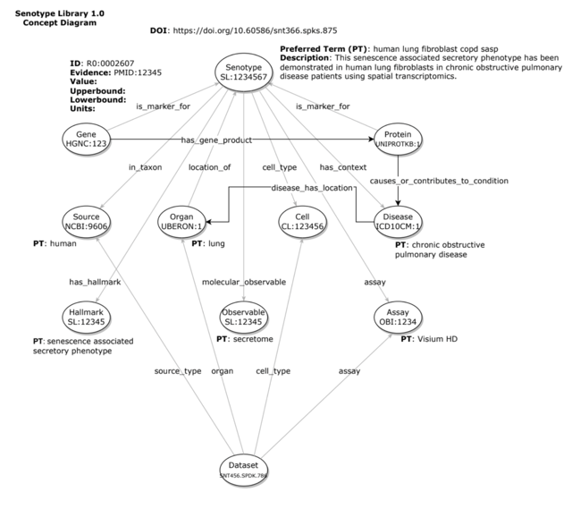
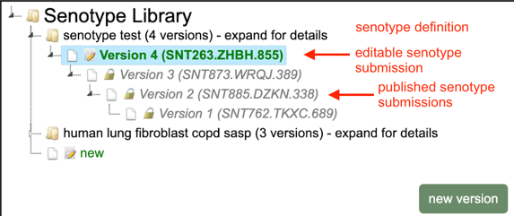
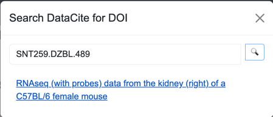
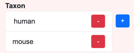
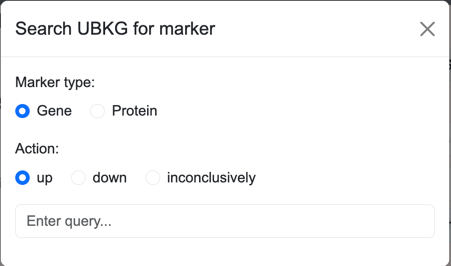

# Senotype Editor
## User Documentation

# Introduction

## Senotype
A *senotype*, or _senescence associated secretory phenotype_, is a cellular senescence functional definition and associated multidimensional description. 
A senotype associates a phenotype with a disease; a set of _markers_ (genes or proteins) expressed by _cell types_ in an anatomic _location_; and an _assay_.

A senotype can be represented as a knowledge graph of relationships between entities. The entities and relationships of a 
senotype can be encoded from standard biomedical vocabularies. For example, the markers associated with a senotype can be
identified with codes from HGNC and UniProt, with a relationship defined by the 
Relations Ontology.



##  The Senlib Database
Senotype definitions are maintained in the *Senotype library*. Senotype definitions are stored in Senlib in JSON format and conform
to the schema defined in the [senlib](https://github.com/sennetconsortium/senlib/blob/main/doc/Senotype_Submission_Schema.md) GitHub repository.

As described in the senlib [provenance model](https://github.com/sennetconsortium/senlib/blob/main/doc/Senotype_Submission_Schema.md#provenance-model),
a senotype corresponds to a set of _submission_ files that represent different versions of the evolving definition of the senotype. 
A senotype submission corresponds to a version of a senotype definition.

Because each version of a senotype can be _published_ by associating it with a Digital Object Identifier (DOI) in DataCite, 
the fundamental level of organization in the Senlib database is the submission. 
Each submission has a unique _SenNet identifier_ in both SenNet and the Senlib database.

## The Senotype Editor
The **Senotype Editor** application allows users to manage senotype definitions in the Senlib database. 
Because the majority of the data in a senotype definition is categorical, most of the work of defining a senotype will
involve the selection of values from lists.

{_screen capture of Edit page_}

With the Senotype Editor, users can:
1. **review** a senotype definition
2. **create** a new senotype definition
2. **revise** an unpublished senotype definition
3. **publish** a senotype definition by associating it with a DOI
4. **create a new version** of a published senotype definition

### Components
The Senotype Editor offers two types of tools:
1. a tool to navigate the Senotype library of _senotype submissions_. 
2. tools to maintain senotype submissions

{_annotated screen capture: Editor page, pointing out Navigator and Definition sections_}

#### Senotype Library Navigator
The **Senotype Library Navigator** represents the Senotype library with an expandable tree view.
The Navigator organizes the different submissions of a senotype definition in version order.

#### Senotype Definition
The **Senotype Definition** composes the remainder of the Senotype Editor. The Senotype Definition section 
allows the user to build or revise a senotype definition. 
The components of the Definition section are linked to both the data of a particular senotype
submission and to possible values for data.

Because most of a senotype definition is encoded, another role of the Definition section is to 
translate the codes of a senotype definition into descriptive terms. 

# Business Rules of the Senotype Editor

Two rules govern whether a user can edit a senotype submission.
1. **A user can only edit a senotype submission file for which they are authorized.** Authorization is controlled by means of the SenNet Consortium's Globus environment.
2. **Only unpublished submissions can be edited**. Once a submission is associated with a DOI, it becomes read-only in the Senotype Editor. To change a senotype definition, a user must create a new version of the definition--i.e., build another submission.

# Using the Senotype Library Navigator
A senotype definition is represented in the Navigator tree with a folder node (  ). Expanding the node for a senotype definition
displays the senotype submissions associated with the definition.

Senotype submission files are represented with a file node ( ). Submission nodes are organized hierarchically in terms of provenance
in the Senlib database. If a submission has a predecessor, the node for the submission can be expanded to view the 
predecessor.

When the user selects a submission file node in the Navigator, the Senotype Editor will load data 
for the submission into the Definition section.



## Edit state
The icon next to a submission node indicates whether the submission can be edited.
1. A lock icon ( ) indicates that the submission has been published and is read-only. The controls in the Definition section will be disabled.
2. A pencil icon () indicates that the submission has not been published and can be edited.

A senotype definition will have, at most, one version (submission file) that can be edited.

## Authorization state
Even if a senotype submission is potentially editable, only authorized users may edit it.
If a senotype shows a "prohibited" icon ( ), the user is not authorized to edit the submission file. 
Although the data for the submission will still display in the Definition section, controls will be disabled.


## Creating a new senotype
The last node in the Navigator allows the user to define a new senotype. The Editor will load 
into the Definition section defaults for the new submission, including:
1. a new SenNet ID
2. the Globus name and email of the user, as submitter

## Creating a new version of an existing senotype
If all of the versions (submission files) of a senotype definition have been published, the user can use
the **new version** button at the bottom right of the Navigator to create a new, editable version. 
The Editor will load into the Definition section:
1. a new SenNet ID
2. the Globus name and email of the user as submitter
3. the data from the latest version of the senotype definition

A user will be able to create a new version of a senotype definition even if the latest version of the senotype was 
created by another user. 

# Using the Senotype Definition tools

## Submission information
The user can edit the **name** and **description** for the submission. 
The Navigator will use the name for the latest version of a senotype definition as 
the name of the definition node.

## DOI

The DOI section allows the user to associate the senotype submission with a DOI in DataCite.

Clicking the  button will launch a search window. 



The search window will search DataCite for a DOI with ID that matches the value that the user enters in the **Enter query...** 
input. Because all senotype DOIs will have the same DataCite provider (e.g, 10.6586), the search window only needs 
the unique portion of the DOI. 

For example, if the DOI's full URL is https://doi.org/10.60586/snt259.dzbl.489, only snt259.dzbl.489 is required as a search term.

If the search window finds a matching DOI in DataCite, it will 
display the title of the citation as a link. If the user clicks the link, the Editor will associate 
the senotype submission with the selected DOI.

The  button in the search window opens the DataCite Commons search window.

When the user associates a DOI with a senotype submission, the Editor warns that saving the DOI with the submission
will make the submission read-only.

The  button allows the user to remove the DOI from the submission.

## Assertions
The bulk of the Definition section allows the definition of assertions.

Each input in the Definition section corresponds to an assertion in the senotype definition.
For example, the **Taxon** input corresponds to the senotype definition's  _in_taxon_ assertion.

There are four types of assertions. Each type has its own tool for selection.

## Valueset-based assertions
The majority of a senotype definition's assertions will be categorical--i.e., the possible values for 
the code of the object of the assertion will be in a _valueset_. For example, the categories for a 
senotype definition's **taxon** might be the valueset {NCBI:9606, NCBI:10088}, corresponding to the codes for 
_human_ and _mouse_.

Valueset-based assertions include:

| assertion            | vocabulary |
|----------------------|------------|
| taxon                | NCBI       |
| location             | UBERON     |
| cell type            | CL         |
| hallmark             | SENOTYPE   |
| molecular observable | SENOTYPE   |
| inducer              | SENOTYPE   |
| assay                | OBI        |


Because there can be multiple assertions of the same type, the inputs for valueset-based assertions are 
lists.



The  button opens a select window that displays a list with the members of the valueset 
associated with the assertion.
 Selecting an element in the list in the select window adds the selected value to
the list for the assertion. The  button removes an element from the assertion list.

## Context assertions

Context assertions allow the user to define ranges and units for an assertion.
. For example, the **age** assertion can be bounded to apply only to the range of 18 to 89 years.

## External assertions
The **citation**, **origin**, and **dataset** assertions are also encoded; however, the codes are not stored in valuesets, but 
are maintained in external sources. 


The Senotype Editor queries APIs to 
obtain information on:
- citation
- origin
- dataset

The external assertion input functions similarly to the DOI:
- The  button opens a search window.
- The  button removes an element from the assertion list.
- The  button links to the corresponding detail page for the assertion. For example, in the **citation** list, the link button opens the PubMed page for the citation.

The search window for an external assertion finds matches in the external site for IDs:

| assertion | source             | type of ID |
|-----------|--------------------|------------|
| citation  | PubMed             | PMID       |
| origin    | SciCrunch Resolver | RRID       |
| dataset   | SenNet Data Portal | SenNet ID  |

The      button in an external search window links to the corresponding external site to facilitate finding an appropriate identifier.

## Marker assertions


A senotype definition has two types of markers:
- _specified_ markers
- _regulating_ markers--markers characterized in terms of how they regulate the senotype

Because it is anticipated that a senotype will be associated with many markers, the entire Markers section is collapsible.

Marker assertion management for both specified and regulating markers is similar:
1. The  button opens a search window that allows the addition of a single marker.
2. The  button opens a window for bulk import of a group of markers.

### Search windows (individual addition)
A marker Search window searches for gene or protein markers. 

The user can enter different types of identifiers for markers, including:
1. HGNC numbers (e.g., 7178)
2. HGNC approved symbols (e.g., MMRN1)
3. HGNC aliases (ECM)
4. HGNC prior symbols (e.g., MMRN)
5. UniProtKB ID (e.g., Q13201)
6. UniProtKB entry name (e.g., MMRN1_HUMAN)


The Search window for regulating markers includes a field for type of regulating:
+ upregulation
+ downregulation
+ inconclusive regulation



### Bulk Addition windows
Bulk addition windows allow the user to load a large number of markers from a local CSV file that the user specifies.

#### Specified markers
The CSV used for bulk upload of specified markers must have the following structure:

| column | values                                                                |
|--------|-----------------------------------------------------------------------|
| type   | either **gene** or **protein**                                        |
| id     | * if a _gene_, the HGNC symbol<br/>* if a _protein_, the UniProtKB ID |

Example:
```commandline
type,id
gene,BRCA1
protein,Q13201
```
#### Regulating markers
The CSV used for bulk upload of regulating arkers must have the following structure:

| column | values                                                                                                                         |
|--------|--------------------------------------------------------------------------------------------------------------------------------|
| type   | either **gene** or **protein**                                                                                                 |
| id     | * if a _gene_, the HGNC symbol<br/>* if a _protein_, the UniProtKB ID                                                          |
| action | one of the following:<br/>* **1** for up regulation <br/>* **0** for inconclusive regulation <br/>* **-1** for down regulation |                                                                 

Example:
```commandline
type,id,action
gene,BRCA1,1
protein,Q13201,0
gene,BRAF,-1
```

# Validation
When the user clicks the Update/Create button at the bottom of the Definition section, the Editor validates the inputs.

If the data is invalid or incomplete, the Editor:
* displays an error message in red at the top of the Editor page
* displays an error message next to the field with an issue

{screen capture: validation error}

The Editor verifies that:
1. All required fields have at least one value.
2. Context assertions are ordered such that **lowerbound** <= **value** <= **upperbound**.

If the data passed validation, the Editor:
* writes the data to the Senlib database 
* displays a success message in green at the top of the Editor page
* resets the Navigator to point to the updated submission


